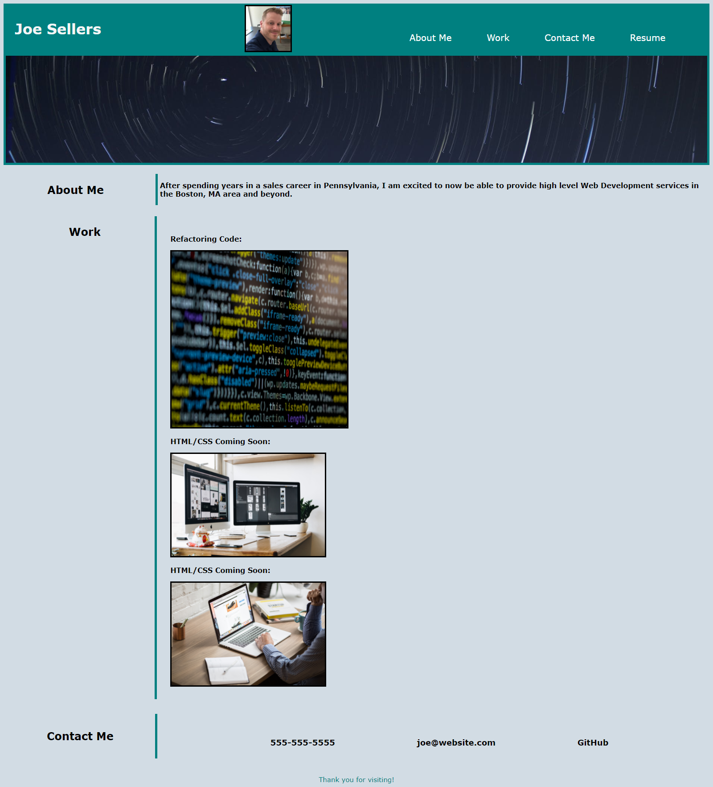

# my-portfolio

## My Personal Wed Development Portfolio

I created a professional website to showcase my skills and abilities for future employers and clients.

It will be continually updated and improved as my future projects are added to demonstrate my full stack capabilities.

By leveraging GitHub, the accessibility to these projects and repositories are convenient and easy to update.

https://joe7web.github.io/my-portfolio/

I was able to contruct this landing page by using html and advanced css.

I was fortunate to have some assistance from Frank Craven and Leif Hetland.  

